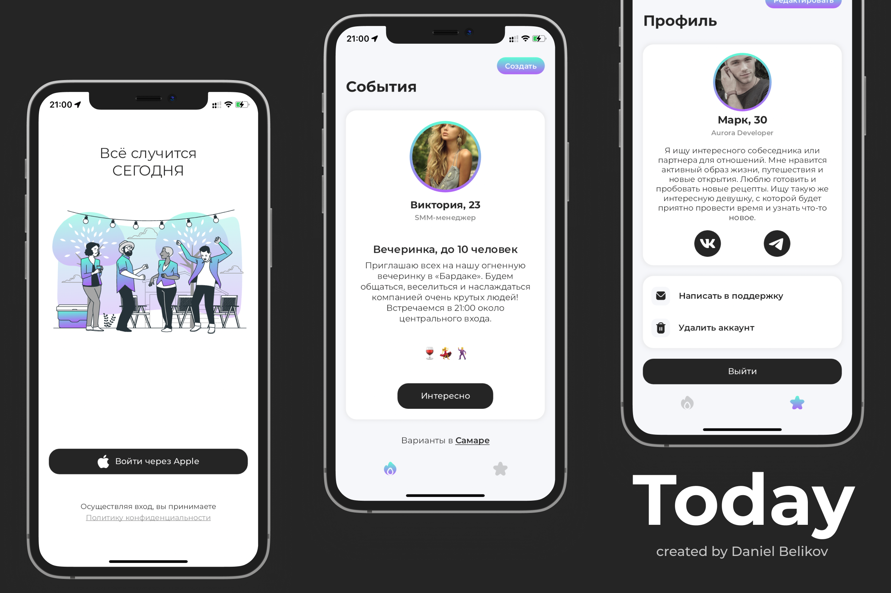

# Today App (Flutter code example)
Today is a mobile dating app based on user activity. This project was created to demonstrate the current level of programming skills in the Flutter framework.

Technology Stack: VSCode, Flutter SDK, Firebase Services (Firestore, Storage, Messaging, Analytics), Bloc, Provider, Hive and Sizer.

Runs on Flutter version 3.16.5.

## Preview:
